# Table of Contents

-   [O that way madness lies, let me shun that](#org618bdbb)
    -   [A Brief Note On This Guide](#org0e39dd9)
-   [Advanced Capture Templates](#org8ec2ae8)
    -   [Template Files](#org1011642)
        -   [Moving a Simple Template String into a File](#orgc29a073)
        -   [Moving a Complex Template String into a File](#org40a063c)
    -   [Nested Capture Templates](#org76a3762)
    -   [Interactive Capture Templates](#org44a343e)
        -   [Book Template](#org02c6e0c)
        -   [Book Template Explained](#org0d2d7ab)
        -   [Creating a New Book](#org8303b80)
-   [Pretty HTML Exporting](#org234c1a8)
    -   [The Problem](#org29f8b29)
    -   [The Solution](#org0d5043a)
    -   [Before and After](#org9ef7154)
-   [Professional Looking PDF Exports](#orgdcd9ee1)
    -   [Install LaTeX](#org8970799)
    -   [Configure Emacs for LaTeX](#org02e8b7e)
    -   [Initial Org Doc Setup](#org8b40de5)
    -   [The Latex Setup File](#org176a862)
-   [Presenting with Org Mode](#orgabe3977)
    -   [How This All Works](#orgd29c09c)
    -   [Begun, the Reveal Wars Have!](#org510bb22)
    -   [Org Re Reveal Configuration](#orge074730)
    -   [Creating a Basic Presentation](#orga496fe9)
-   [Org Roam](#orgd6a93f8)
    -   [An Introduction To Crafting A 2nd Brain](#org64e15d3)
        -   [What are we even talking about?](#org2c11282)
        -   [Who would ever use this?](#org9bce075)
        -   [Real use cases](#org0752525)
    -   [Core Concepts Explained](#org4776af9)
        -   [Terminology](#org3393dc3)
            -   [Nodes](#org71ca41c)
            -   [Links](#org241a542)
            -   [Backlinks](#org6cdbd22)
        -   [File management](#orgd336b83)
    -   [Basic Configuration](#org8aa7ffb)
    -   [Basic Configuration Explained](#org6a2627f)
        -   [`C-c n f` - Find a node](#orgdc422fc)
        -   [`C-c n i` - Insert a node](#org8e0d240)
        -   [`C-c C` - Open a capture template](#orgec4f049)
        -   [`C-c n l` - Show backlinks](#orgadd4af9)
        -   [`C-c n t` - Add a tag to filetags, NOT a headline](#orgad5506a)
        -   [`C-c n o` - Create a node at a headline](#org8b25af2)
        -   [`C-c n a` - Create an alias](#org828ae34)
        -   [`C-c n r` - Grab random node](#org2215f3e)
    -   [Org Roam Capture Templates](#orge497490)
        -   [Capture Template Example](#org860b70b)
        -   [Default Capture Template Syntax Explained](#org7dc97a5)
        -   [Advanced Capture Template Syntax Explained](#org8a7cf63)
    -   [Org Roam UI](#org4b8b4ad)
        -   [Basic Configuration](#org09dc3c3)
        -   [Awesome Examples](#orge5d98ea)
-   [Farewell](#org5a9c1b2)

# O that way madness lies, let me shun that

Welcome to the advanced Org Mode features guide. This is a walk-through for Org Mode users who are tired of the weak stuff and are looking for something a little stronger. Here you will find more complex examples than in your typical Org Mode primer. This guide covers bigger and badder capture templates, a variety of export options, and a breakdown of Org Roam designed to turn anyone into a note taking maniac. But hey, let's face it, if you're here it's because you're already an Org Mode addict like me. On that note, let's get to it.

## A Brief Note On This Guide

This guide IS NOT for new Emacs users or for new Org Mode users. If you are new to Emacs, go check out [System Crafters](https://www.youtube.com/c/SystemCrafters) on Youtube. That guys is amazing. If you are new to Org Mode then I have a [guide for new users](https://github.com/james-stoup/emacs-org-mode-tutorial) that I encourage you to check out. If you are still here I'm going to assume that you already have Emacs fairly well configured to your tastes and don't need the basics explained to you.

Also, each section of this guide is self contained. There will be several sections that are similar, but that is done on purpose. Every major section can stand on its own. Which means you don't have to read through this entire guide just to understand something at the end. Skip to whatever you need and don't worry that you are missing some obscure step from five sections previous.

# Advanced Capture Templates

It is fitting that we start here. After all, capture templates are a large part of what makes Org Mode so damn useful. However, the more templates you create, the more cluttered everything becomes. You configuration file becomes littered with formatting strings and your capture template starts to become unreadable. But we can fix all that.

## Template Files

As your capture templates become more complex over time, working with them can be difficult. The string that defines the template can only be so long before it becomes completely unreadable. For example, a template string with several headlines, tags, a list, and some text could be 100+ characters long. The solution is to abstract out the template itself into a separate file for easier modification.

### Moving a Simple Template String into a File

A basic capture template for a journal entry might look like this:

    (setq org-capture-templates                           ;; 1
          '(                                              ;; 2
            ("j" "Journal Entry"                          ;; 3
             entry (file+datetree "~/org/journal.org")    ;; 4
             "** %? %^g"                                  ;; 5
             )                                            ;; 6
            )                                             ;; 7
          )                                               ;; 8

Notice that the actual template (shown on line 5) is just a heading, a prompt for tags, and the eventual location of the cursor. This works, but we can do better. Let's move the template string into an external file, and then reference it. This not only makes our capture template definition cleaner, but now we can make a larger, more readable template string without having to worry about manually putting in new lines.

Here is the same capture template extracted into a file.

    (setq org-capture-templates
          '(
            ("j" "Journal Entry"
             entry (file+datetree "~/org/journal.org")
             (file "~/org/templates/journal-entry.org")
             )
            )
          )

And the corresponding entry in the template file:

    ** %? %^g

### Moving a Complex Template String into a File

Now that the actual template has been extracted, we can format it like any other Org file. Let's look at a more interesting example.

Here is a capture template for a meeting:

    (setq org-capture-templates
          '(
            ("m" "Meeting"
             entry (file+datetree "~/org/meetings.org")
             "* %? :meeting:%^g \n:Created: %T\n** Attendees \n** Notes\n** Action Items\n*** TODO [#A] "
             :tree-type week
             :clock-in t
             )
            )
          )

As you can see, the template string is not easy to read. When the entire template has to fit into a single string you end up with lots of newlines, to say nothing of how difficult it can be to manage indentation and lists. But we can make this better. Here is that same template, extracted into a file.

    (setq org-capture-templates
          '(
            ("m" "Meeting"
             entry (file+datetree "~/org/meetings.org")
             (file "~/org/templates/meeting-event.org")
             :tree-type week
             :clock-in t
             )
            )
          )

And the corresponding template file.

    * %? :meeting:%^g
    :Created: %T
    ** Attendees
     -
    ** Notes
    ** Action Items
    *** TODO [#A]

By breaking it out like this suddenly the template becomes much easier to read. No need for `\n` or extra spaces cluttering up things. Now, everything is cleanly organized in an Org file.

## Nested Capture Templates

At this point you have no doubt gone to your Org Mode configuration and cleaned up your capture template definitions. They now reside in their own template files, where they can be expanded to your heart's content. However, while cleaner, you do still probably have a lot of capture templates hanging around.

To better organize things we can put similar templates into logical groupings. In this way, only the initial grouping will be displayed, allowing for a cleaner interface. Here is the code for nested groups.

    (setq org-capture-templates
          '(
            ;; Suggested Media Sub-Section
            ("s" "Suggested Media")
            ("sb" "Books"
             entry (file+headline "~/org/suggested-media/bookshelf.org" "Literature")
             (file "~/org/templates/suggestion-book.org")
             )
            ("sm" "Movies"
             entry (file+headline "~/org/suggested-media/videorack.org" "Movies")
             (file "~/org/templates/suggestion-movie.org")
             )
            ("st" "TV Shows"
             entry (file+headline "~/org/suggested-media/videorack.org" "TV Shows")
             (file "~/org/templates/suggestion-tv.org")
             )
            ("sg" "Games"
             entry (file+headline "~/org/suggested-media/gamedrawer.org" "Games")
             (file "~/org/templates/suggestion-game.org")
             )
            ("se" "Everything Else"
             entry (file+headline "~/org/suggested-media/randomstuff.org" "Everything Else")
             (file "~/org/templates/suggestion-misc.org")
             )
            )
          )

You would still invoke the capture template as usual, however, instead of seeing all the options at once, you would now only see the `s` for `Suggested Media`. After pressing `s` you will then be presented with the options `b`, `m`, `t`, `g`, or `e`. Which corresponds to books, movies, TV shows, games, or misc.

This is a much cleaner way of organizing things because you aren't presented with every option all the time. Here's how this looks in practice:

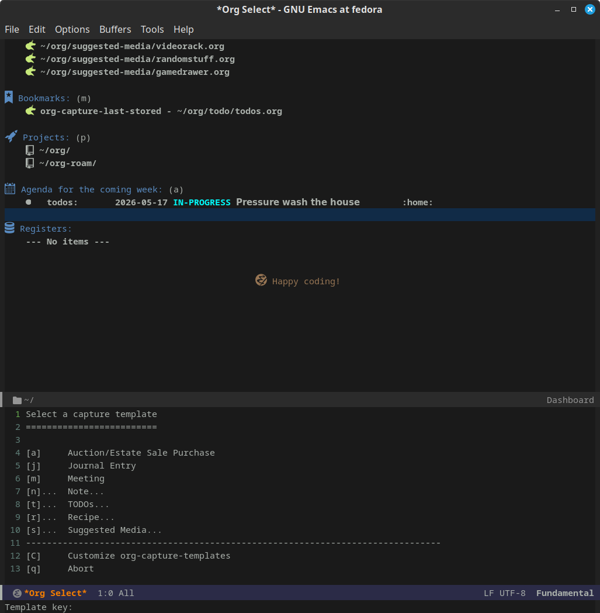

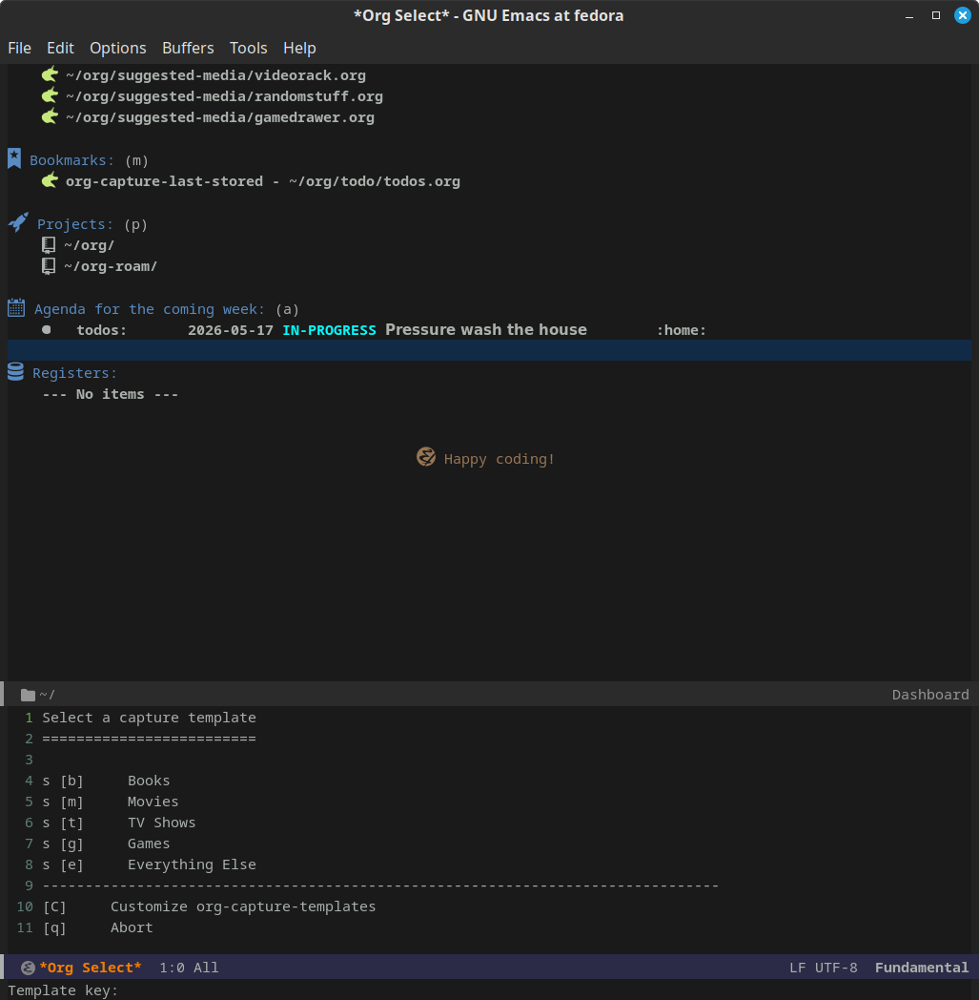

## Interactive Capture Templates

The default behavior for many capture templates often has the user adding tags, possibly adding a timestamp, and then dropping you into the buffer to begin adding text. And while this approach is fine for many use cases, the system allows us to do so much more.

What if we want to add other prompts for specific data that is relevant to that particular capture template? Let's look at the `Suggested Media` capture template group from the previous example. Each capture template is different enough from the others that using the same format for each would be counterproductive. For example, adding an `author` field to the `Books` section makes sense, but less so for `Movies` or `TV Shows`.

But more than just having different templates, we want the templates to prompt the user to fill in specific fields once the capture template has been invoked. By forcing the user to enter data the end result is more structured and cohesive. Let's examine the two files that make the `Books` capture template work.

-   `suggestion-book.org` - the template that describes a new book
-   `bookshelf.org` - the location of each new record

When a new book entry is created, first Org loads the template definition located in `~/org/templates/suggestion-book.org`. Once the record is complete, it gets saved into `~/org/suggested-media/bookshelf.org`. Let's look at the template file to see what is actually happening.

### Book Template

Here is what that template file looks like:

    ** TODO %\1 - %\2 :@media:%^g       ;; 1
    :PROPERTIES:                        ;; 2
    :TITLE: %^{title}                   ;; 3
    :AUTHOR: %^{author}                 ;; 4
    :SOURCE: %^{source}                 ;; 5
    :DATE: %T                           ;; 6
    :END:                               ;; 7
                                        ;; 8
    %?                                  ;; 9
    *** Review                         ;; 10

There are three different components at work here: basic Org Mode syntax, user defined variables, and finally references to those user defined variables. Now the basic syntax you know already. The `** TODO`, `:PROPERTIES:`, etc. all operate as usual. However the other two are more tricky.

Notice that the `%^{title}`, `%^{author}`, and `source` fields are special variables that have been defined by the user. These variables tell Org Mode to interactively ask the user for input once the capture template has been activated. Then once those variables have been capture, they can be placed within the document. In this case the `%^{title}` and `%^{author}` are both going to go into the `:PROPERTIES` drawer, but they are also going to be copied into the `** TODO` line. The first value is the title of the book followed by the author of the book, with a dash to separate them. Isn't that clever?

### Book Template Explained

For clarity we are going to go through the template line by line, explaining how each piece fits as we go.

**line 1** - This line contains the heading stars, the `TODO`, the `%^{title}` placeholder, the `%^{author}` placeholder, a tag for `:@media:`, and finally the `%^g` notation which prompts the user to enter a tag.

**line 2** - The start of the `:PROPERTIES:` drawer.

**line 3** - The first user created prompt. See the [Org Wiki](https://orgmode.org/manual/Template-expansion.html) for more details on template expansion, but this piece here `%^{title}` is what prompts the user for a book title. Once entered Org then replaces that value along with the `%\1` in line 1, with the title you entered. If you have more structured data you can create defaults or have a pregenerated list. For example, if you were entering grades it might look like this: `%^{grades|missing|A|B|C|D|F}`. Where the default value is `missing` and what follows are all the valid responses the user can select.

**line 4** - Here we have the prompt for the `%^{author}`. It behaves exactly like the `%^{title}` did. Since it is the second prompt value it will replace the `%\2` with the value entered for `%^{author}`.

**line 5** - The `%^{source}` behaves like the previous two user prompts with one difference. Unlike the prompts for the book's title and author, we only want the source of that information to appear in the `:PROPERTIES:` drawer. That is why there is no `%\3` in the template. In this example the source could be a podcast reviewing books, a top 100 list on your favorite literature website, or your friend Alan. Either way, you want to track that info without it appearing in the text of your `TODO` heading.

**line 6** - Here we get another piece of common Org Mode syntax. The `%T` will just insert the current date.

**line 7** - This concludes the `:PROPERTIES:` drawer.

**line 8** - This space is purely for aesthetic reasons.

**line 9** - Now finally we come to the `%?`, which is where your cursor will start once you've finished entering data into the prompts.

**line 10** - Last, but not least, there a heading for you to write a review once you've finished your book.

### Creating a New Book

Let's see how this works in practice. Assuming you have copied the above code into your own setup and restarted Emacs, you can now follow along as you capture your first book.

1.  Invoke the capture template with `C-c c`
2.  Type `s` for `Suggested Media`
3.  Then type `b` the subsection `Books`
4.  Enter `fantasy` as your book tag
5.  Enter `American Gods` as the title
6.  Enter `Neil Gaiman` as the author
7.  Enter `James` as the source
8.  Enter `I heard this was a great book from the Org Mode guy`
9.  Save your new record with `C-c C-c`

You have now saved your first book entry.

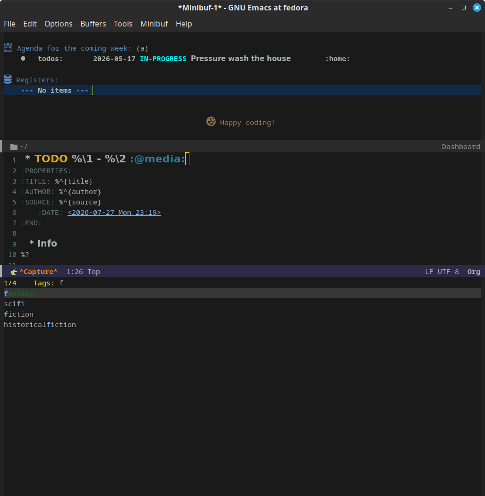

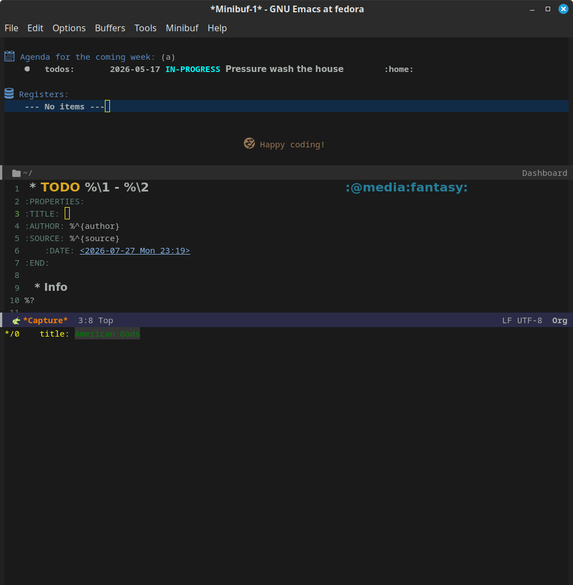

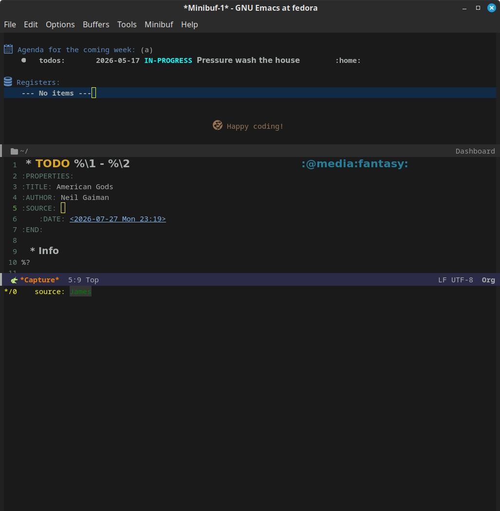

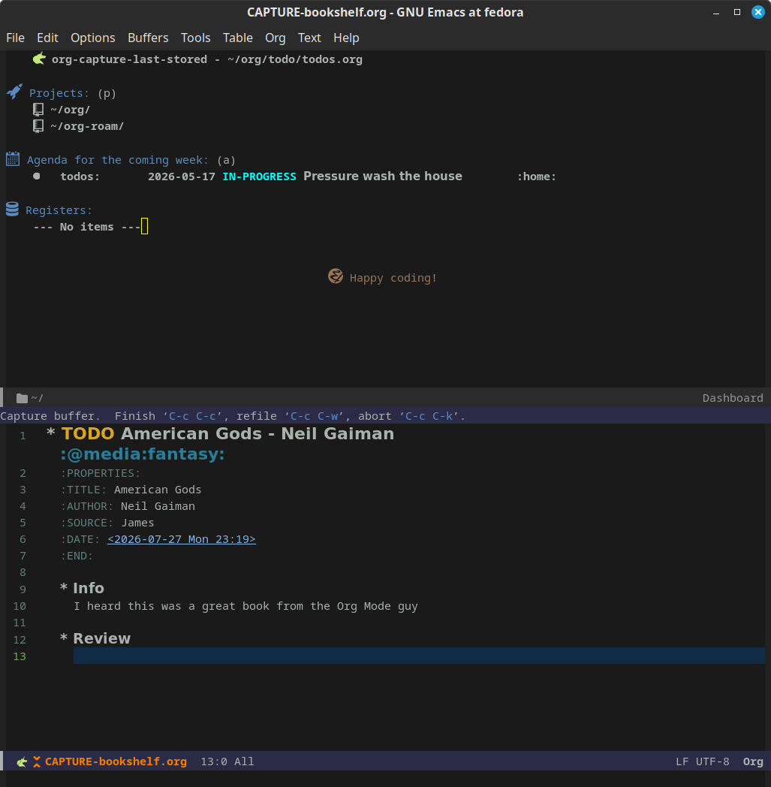

# Pretty HTML Exporting

## The Problem

I frequently find a need to export some chunk of org data and either print it or display it for a non org user to view. In these situations I would like to make it pretty, but I also don't want to spend an excessive amount of time configuring things. Realistically, I'd just like a "pretty print" option that I don't have to think about.

## The Solution

The easiest way to accomplish this is to export to HTML with an additional style sheet to make it look nice. Adding this block of options at the top of the file will allow for a much nicer HTML export.

    #+TITLE: Work Notes
    #+AUTHOR: James Stoup
    #+OPTIONS: num:nil
    #+OPTIONS: H:4
    #+HTML_HEAD: <link rel="stylesheet" type="text/css" href="https://gongzhitaao.org/orgcss/org.css"/>

Let's go over what each of these extra options actually do. Before we start though it is helpful to first look over the [Org Mode Export Settings](https://orgmode.org/manual/Export-Settings.html) that are defined in the official documentation. Pay close attention to all the various entries for the `OPTIONS` keyword. In this case I'm only using the `num` and `H` options, however as you can see there are quite a few choices.

But in the case above, `num:nil` tells org export not to include numbers in the exported sections. If you want your headings numbered you can remove that. The `H:4` setting sets the headlive level for export as a headline. Everything after that number gets treated differently. This is useful for minimizing the size of your Table of Contents.

## Before and After

I find this simple export trick so handy, I used it quite frequently when writing this guide. I would export this document to html, open it in Firefox, and review my nicely formatted doc. In fact, the options are still embedded in this file. So if you would like to see for yourself what it looks like, just export it as html and open it in your browser of choice.

However, to speed things along, I'm going to show you a few snippets of what this document would look like with and without this enhancement.

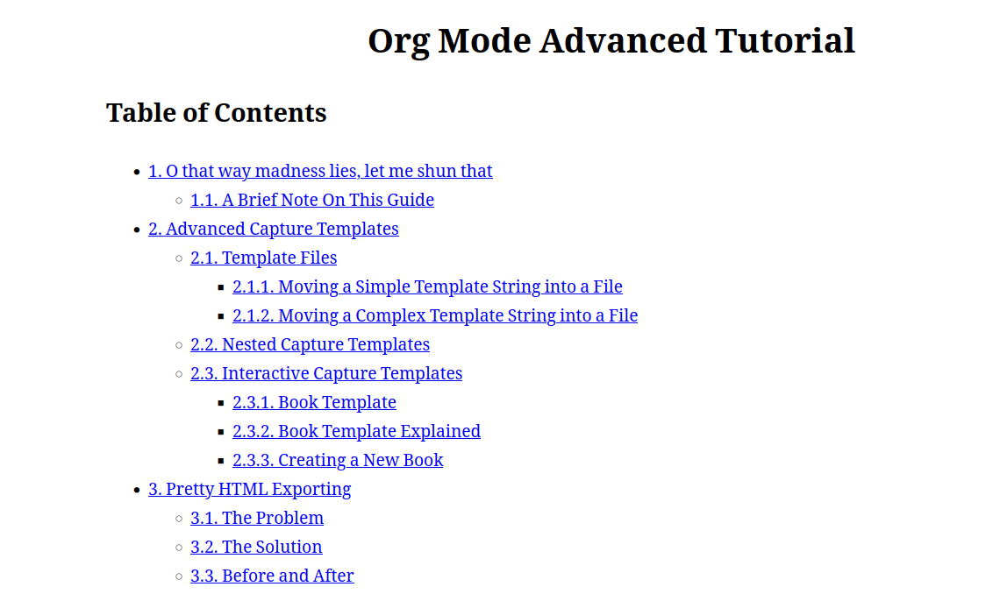

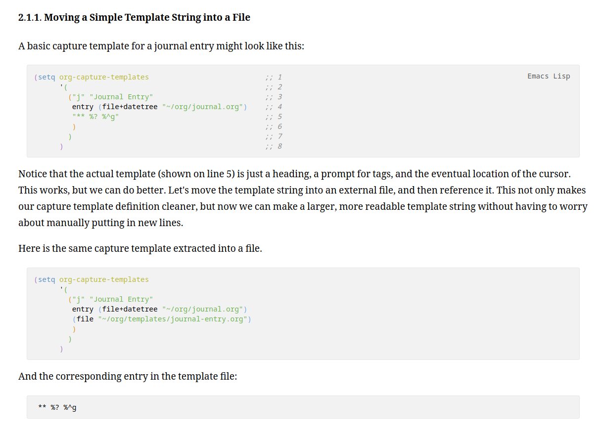

And here is the new, prettier version.

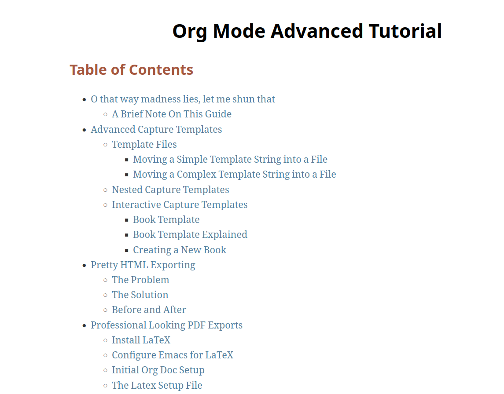

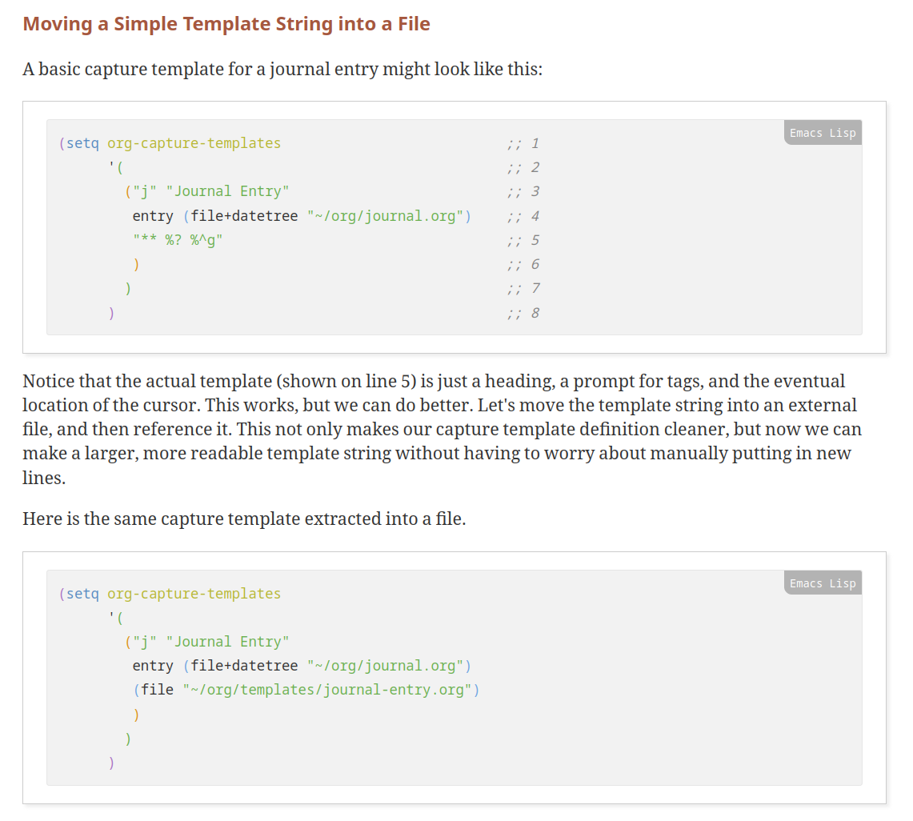

This can now be printed or saved as a PDF from your web browser for a quick solution.

# Professional Looking PDF Exports

This is considerably more complex than just throwing a style sheet on your org file, so unless you really need to export documents with specific formatting, this is overkill. But you wouldn't be here if you didn't have a high threshold for pain, let's do this.

## Install LaTeX

The first thing that needs to be done is you need to install LaTeX onto your systems. I'm developing in Fedora so the instructions will be relative to that. However, if you are using Ubuntu or some other flavor of Linux the instructions should be readily available. This tooling is supported pretty much everywhere. If you are lazy like me and don't feel like specifying the handful of packages you need, you can of course install it like so:

    sudo dnf install -y texlive*

And that will pull in 7,000 packages (most of them are language packs) and most definitely install all your dependencies.

## Configure Emacs for LaTeX

Next we need to tell Emacs how to handle LaTeX.

    ;;-------------------------------------------------------------------------------------------
    ;; LATEX
    ;;-------------------------------------------------------------------------------------------
    (setq org-latex-compiler "xelatex")
    (setq org-latex-pdf-process '("xelatex %f"))
    (setq org-latex-listings 't)
    
    (require 'ox-latex)
    (add-to-list 'org-latex-classes
                 '("org-plain-latex"
                   "\\documentclass{article}
                   [NO-DEFAULT-PACKAGES]
                   [PACKAGES]
                   [EXTRA]"
                   ("\\section{%s}" . "\\section*{%s}")
                   ("\\subsection{%s}" . "\\subsection*{%s}")
                   ("\\subsubsection{%s}" . "\\subsubsection*{%s}")
                   ("\\paragraph{%s}" . "\\paragraph*{%s}")
                   ("\\subparagraph{%s}" . "\\subparagraph*{%s}")
                   )
                 )
    
    ;; No, these are not duplicated by accident. Yes, we need both of them.
    (setq org-latex-pdf-process
          '(
            "pdflatex -shell-escape -interaction nonstopmode -output-directory %o %f"
            "pdflatex -shell-escape -interaction nonstopmode -output-directory %o %f"
            )
          )
    (put 'upcase-region 'disabled nil)

I'm going to be honest here, out of everything I've ever configured with Emacs, getting LaTeX working was, by far, the most challenging. Just getting the Emacs side of things was painful enough, but configuring the LaTeX setup file was an entirely new level of stress. As such, I know *that* this configuration works, but not exactly *why* every piece of it works. And by the time I got this far, I was beyond done screwing with it. So if you want a more detailed explanation regarding the inner workings of LaTeX, you will need to consult their official documentation. In which case, God be with you.

## Initial Org Doc Setup

At the top of your org file you will need to add the `#+SETUPFILE:` keyword along with a path to your latex setup file. This will contain all of the latex formatting to be applied to your document.

    #+TITLE: My Sexy PDF
    #+SUBTITLE: Version 1.0
    #+AUTHOR: James Stoup
    #+CREATION_DATE: <2025-01-01 Wed>
    
    #+OPTIONS: toc:3 H:5
    #+SETUPFILE: ~/org/latex-pdf.setup

## The Latex Setup File

This is the file where all the magic happens. I would like to preface this with the disclaimer that I am in no way a latex expert. I cobbled this together from many different sources and I no longer recall where I got which part from or I would credit them. But make no mistake, latex formatting is not for the faint of heart. It is a beast.

Here you go, the [LaTeX PDF setup file](latex-pdf.setup).

Please don't ask me any questions about the syntax of this file. LaTeX made me cry. I figured it out and then promptly swore I wouldn't touch this again if the gods just got my file exporting properly. They did and so I took it and ran.

# Presenting with Org Mode

If you work at a job long enough there is a good chance you will eventually need to produce a presentation. And while I cannot help you with stage fright, speaking to a crowd, breathing exercises, or being charismatic, I can help you make your presentation in Emacs.

Since tools like PowerPoint (and their many clones) exist, it might not even occur to most Emacs users to search for an alternative. After all, isn't PowerPoint good enough?

No actually, it is not.

PowerPoint encourages you to **add** many things to your presentation, whether that be animations, music, 3D effects, bright colors, goofy fonts, etc. When in reality, the vast majority of presentations I've sat through could chiefly benefit from having less features rather than more.

That is why crafting presentations with Org Mode, in my opinion, is so much better. You already have your notes in Org Mode so you are already 90% of the way there. You can create a new org file, paste in some options, copy in your notes, and then export your presentation to your browser.

## How This All Works

Before we go on I need to clarify a key point. You won't actually be using Emacs to run your presentation. What you will actually be doing is using `Reveal.js` help turn an Org file into a presentation. Here are the basics steps you will take to dazzle your audience.

1.  Create an Org file to contain your presentation
2.  Structure it with standard Org syntax and formatting
3.  Export it using Reveal (details discussed in the next section)
4.  Open the generated presentation in a web browser
5.  Control the presentation from your browser, not Emacs

## Begun, the Reveal Wars Have!

The real trick is installing [Reveal.js](https://revealjs.com/) to power everything. Reveal is a very cool javascript utility for creating beautiful HTML presentations. However, you will also need to install an Emacs package to interface with Reveal, and that's where this gets a little weird. If you just search for "Emacs" and "reveal" you might find:

-   `org-reveal` - the OG reveal library
-   `org-re-reveal` - the fork of `org-reveal` after it temporarily stopped being maintained
-   `oer-reveal` - export backed derived from `org-re-reveal`
-   `emacs-reveal` a bundling of the three previous packages

So which should you use? In my configuration, I use [org-re-reveal](https://github.com/emacsmirror/org-re-reveal). It has worked well for me and I really like it. However, I think the consensus is drifting towards `emacs-reveal`. Checkout this [great walkthrough](https://oer.gitlab.io/emacs-reveal-howto/howto.html#/sec-title-slide) for `emacs-reveal` to see if it is what you want. Either should be fine.

That being said, by the time you read this guide, things could have easily changed yet again. Who knows, maybe `org-re-reveal` will be old and busted and `org-re-re-reveal` will be the new hotness. Either way, because of that ambiguity I'm not including instructions here for installing the `reveal.js` library. Pick a package, install Reveal however they recommend, and then go live your best life. I'm going to provide the configuration for my setup and you can use that, or not, as you like.

## Org Re Reveal Configuration

Here it is, everything you need in your configuration file!

    ;; Org Reveal
    (use-package org-re-reveal
      :custom (org-re-reveal-root "file:///home/jstoup/tools/reveal.js")
      )

Remember, you must install `reveal.js` regardless of what interface package you use.

## Creating a Basic Presentation

The first step towards making your presentation is to create a properly structured Org file. Each heading is going to be a slide. Top level headings (i.e. one star) will serve as the root node and sub headings will to main heading will become subpages.

This can be a little confusing in text, but it makes sense visually. Checkout this [great walkthrough](https://oer.gitlab.io/emacs-reveal-howto/howto.html#/sec-title-slide) to see a real presentation in action. You can navigate between the root nodes via left and right, and explore those nodes with the up and down keys. That presentation also contains tons of great tips, advice, instructions, etc. and I really encourage you to check it out. I'm only giving the basics here, but that link provides a more in depth look at what you can accomplish with Reveal.

If you check out the [Sample Presentation File](sample-presentation-2.md) included with this guide, you will see an Org file that is setup to be exported into a presentation. Take a look at the options appearing at the top of the sample file:

    #+OPTIONS: toc:nil num:nil date:nil
    #+REVEAL_THEME: league
    #+REVEAL_TRANS: slide

In this example I'm setting two special values that will change how the presentation looks.

-   `REVEAL_THEME` - This is a predefined theme that comes with Reveal. There are lots to choose from.
-   `REVEAL_TRANS` - This is the transition. I think the slide is quite elegant as I dislike flashier options.

There are of course many more options for you to play with, but these two are enough to start.

In the sample presentation file you will see the structure of how the presentation is laid out. Short sentences, small number of bullet points, and self contained headings. Once you've gotten `reveal.js` as well as the reveal related package of your choice installed, you can take a look at the HTML file that it exports to. Once you are ready, go to the presentation and execute the following:

-   `C-c C-e` to open the export buffer
-   `v v` to select Reveal and export to a file
-   open the generated HTML file in your web browser

Now you can navigate through the presentation using only the arrow keys on your keyboard.

# Org Roam

## An Introduction To Crafting A 2nd Brain

### What are we even talking about?

Org Roam bills itself as "A plain-text personal knowledge management system" which is both very true but very vague. It isn't clear what exactly it does, but clearly it is complicated. Or at least that is the vibe it seems to give. Actually, Org Roam is just a fancy way of linking Org files together in a unique manner.

Further complicating things is that if you read anything about Org Roam you will eventually come across "The Zettelkasten Method". An intimidating phrase if ever there was one. In short, the Zettelkasten Method is a way of organizing information by using note cards that reference each other. You write an idea on the note card and then on the back of the card you can write references to other cards that contain related ideas. That's it. That's the whole thing. You can make it more complicated, you can make it fancier, but the core of it is single ideas linked together.

Organizing your data like this, as it turns out, has some very useful side effects. For example, you can start with one note card and, by following the references on the back of it, find other note cards that relate to it in some way. By repeatedly following the links you can discover new ideas, find hidden connections, and organically explore the subject matter you are interested in. This concept of knowledge discovery is familiar to anyone who has gotten bored at 2am and started clicking on random links in Wikipedia. You start by reading about the history of the modern banana and two hours later you are reading about the jade trade and how critical it was to the identification of bureaucrats within the government of the Zhou dynasty. You can perhaps now see how Org Roam (a system for linking Org files) and the Zettelkasten Method (a system for linking notes) might fit together.

### Who would ever use this?

At this point you are probably thinking "this is all somewhat fascinating, but why would I, a normal person, need this?" My counter argument is, you are willingly reading about Emacs knowledge management systems so perhaps calling yourself "normal" is a bit optimistic.

But to be perfectly honest, Org Roam isn't going to be for everyone. I feel very confident that your average person could drastically improve their lives by using Emacs and Org Mode. I feel very differently about Org Roam. I like Org Roam, but much like licorice, IPAs, and tongue piercings, it isn't for everyone.

Who then, can most benefit from using Org Roam? Here is my suggested list of people who could really benefit from a system like this:

-   college students
-   writers
-   game designers
-   DnD Dungeon Masters
-   researchers
-   project managers

This isn't an exhaustive list by any means, but rather, these are some roles that would probably benefit from the structure that Org Roam provides. But if you aren't on this list, don't let that stop you from experimenting with Org Roam. Just be aware that you might have to work harder to make this system work for you.

### Real use cases

Org Mode is so incredibly useful because anyone can use it to record any data in any format they desire and still get a lot of utility out of it. You might only use Org Mode to organize your favorite recipes and mattress stores. However, with Org Roam, a system that is defined by forming relationships between data, this might not be your best solution. Since there is very little overlap between recipes and mattresses.

However, writers crafting a world, researchers collecting bits of data, or managers tracking a large team all could very easily benefit from this kind of system. I bring up these examples because I want to stress that while anyone can use Org Roam, you really need to go into it with a clearly defined idea of how you are going to make it work for you.

## Core Concepts Explained

### Terminology

I am going to walk you through all the commands as well as the workflow Org Roam requires, however first we need to define some terms. This is the crux of the system so let's define them now before we get too much deeper into this. These common terms are:

-   node
-   link
-   backlink

#### Nodes

Nodes are any document that you create via the Org Roam capture template. All nodes are Org files, but not all Org files are nodes. A node will always have a properties drawer with an `:ID:` tag in it. There can be more data in there, but that ID tag has to be in there for Org Roam to work. It looks like this:

    :PROPERTIES:
    :ID:       9939d72f-acdb-45b7-92be-febff0bdf5d7
    :END:

#### Links

A link is a standard Org link to an Org Roam node. You should never try to create these links manually, only create them with the `org-roam-node-insert` command. These links will be used to find nodes, populate the backlinks list, and create visualizations of your data. If you break a link then you will lose the ability to find your node.

#### Backlinks

Backlinks are just a list of links reference the node you are currently on. By calling `org-roam-buffer-toggle` Org Roam will open a new buffer and display everything that links to this file.

For example, if you were on a node named "spiderman" and you brought up the backlinks, you would expect to see nodes labeled "MJ", "venom", "green goblin", and so on. As each one of those pages would link back to your original node, "spiderman". Backlinks are how you organically find patterns in your data.

### File management

When using Org Mode it is encourage to keep your org files sorted into logical directories and sub-directories. You don't have to, but I find that most people tend to sort things into fairly useful groupings, even though strictly speaking, it isn't really necessary. But if you have been using Org Mode for a long time you might have directories that look like this:

    ├── org-files
    │   ├── entertainment
    │   │   ├── boardgames.org
    │   │   ├── cardgames.org
    │   │   ├── drinkinggames.org
    │   │   └── video-games
    │   │       ├── consolegames.org
    │   │       ├── pcgames.org
    │   │       └── retrogames.org
    │   ├── food
    │   │   ├── baking.org
    │   │   ├── bbq.org
    │   │   └── drinks.org
    │   └── parties
    │       ├── birthdays.org
    │       ├── orgies.org
    │       ├── retirements.org
    │       └── weddings.org

This is a totally reasonable way of organizing your files. Because regardless of how you are finding files (searching by name, looking for tags, searching for strings) it helps to organize your files in a way that makes sense so that you can take some of the mental load off of discovering files. After all, you could have all of these files in the `org-files` directory and Org Mode would function just fine. Or you could combine all of these files into a massive org file and, once again, Org Mode would handle that just fine. However we generally don't do that because that's not how humans think and doing it that way isn't great for our brains.

And then there is Org Roam, a system that encourages you to NOT look under the hood. In this system not only do you not organize your files, you don't even really name them either. Instead you come up with a name and Org Roam handles actually creating the files, with you being none the wiser for what is actually happening. Here is what I mean. Let's say you create an Org Roam node called "Las Vegas Trip", you might assume that a file is generated called "Las Vegas Trip.org", but you would be wrong. What actually gets created is something like this: `20250208162108-las_vegas_trip.org` and it joins all of the other org files in the root of the `org-roam` directory.

This isn't a problem because Org Roam has great features for finding your nodes and organizing them into easily discoverable pieces. However, this takes some time to go from "organize everything via directories" and towards "organize everything via links". This isn't hard, but it does require a different way of looking at things.

*To clarify, you can have directories with Org Roam. You can actually set specific capture templates to use different directories and then filter your search results by directory, if you implement enough custom logic. However, out of the box, it is all in one big directory.*

## Basic Configuration

Here is the configuration I use for Org Roam. There are two key parts. The first sets up common keybindings and the second modifies the display buffer for nodes.

    ;; Set the location of your org-roam directory
    (setq org-roam-directory (concat (getenv "HOME") "/org-roam/"))
    
    ;; use-package configuration for Org Roam
    (use-package org-roam
      :after org
      :custom
      (org-roam-directory (file-truename org-roam-directory))
      ;; :init
      :bind (
             ("C-c n f" . org-roam-node-find)            ;; find a node (most used command)
             ("C-c n r" . org-roam-node-random)          ;; grab random node
             ("C-c C"   . org-roam-capture)              ;; open the capture template
    
             (:map org-mode-map (
                    ("C-c n a" . org-roam-alias-add)     ;; create an alias
                    ("C-c n i" . org-roam-node-insert)   ;; insert a node
                    ("C-c n l" . org-roam-buffer-toggle) ;; show backlinks
                    ("C-c n o" . org-id-get-create)      ;; create a node at a heading
                    ("C-c n t" . org-roam-tag-add)       ;; add's tag to filetags, NOT heading
                    ))
             )
      :config
      (org-roam-setup)
    
      ;; The code for enhancing the org-roam-node-display-template comes from a really wonderful
      ;; configuration from Vidianos Giannitsis on github. You can find his full config here:
      ;; https://github.com/Vidianos-Giannitsis/Dotfiles/blob/master/emacs/.emacs.d/libs/zettelkasten.org
    
      ;; Calculating the backlinks count
      (cl-defmethod org-roam-node-backlinkscount ((node org-roam-node))
        (let* ((count (caar (org-roam-db-query
                             [:select (funcall count source)
                                      :from links
                                      :where (= dest $s1)
                                      :and (= type "id")]
                             (org-roam-node-id node)))))
          (format "[%d]" count)))
    
      ;; Uses the previously defined functions to provide much cleaner search results
      (setq org-roam-node-display-template "${backlinkscount:3} ${tags:40}")
      )

## Basic Configuration Explained

Before we begin I would like to thank Vidianos Giannitsis and his excellent [Org Roam configuration](https://github.com/Vidianos-Giannitsis/Dotfiles/blob/master/emacs/.emacs.d/libs/zettelkasten.org) that inspired me to really start using Org Roam. His configuration is beyond overkill for most people (I myself only use a tiny fraction of what he uses) but it is very cleanly written and I encourage anyone interested to go check out his stuff.

The configuration above consist of two main parts, the keybindings and the display template. Let's go over the keybindings first, starting with the most used first.

**Brief Note** - For the following examples I will be using my own Org Roam files and, as you will no doubt notice, I use Org Roam primarily for keeping track of all the Dungeon and Dragons games that I play in or run. I play in several different games and I write adventures as well, so my Org Roam database is filled with monsters, characters, story lines, plot ideas, and other nonsense.

### `C-c n f` - Find a node

This is my most used command, by far. When executed it will open the mini buffer with the list of available nodes. The default display is just a list of nodes, but we can do better than that. By modifying the `org-roam-node-display-template` variable we can add additional useful information such as the number of backlinks and the tags associated with the node. If you decide you want additional then I encourage you to go look at Vidianos Giannitsis' [Org Roam configuration](https://github.com/Vidianos-Giannitsis/Dotfiles/blob/master/emacs/.emacs.d/libs/zettelkasten.org) for more ideas on what you can do.

Let's find a node. Here is what I see when I search for "silver":

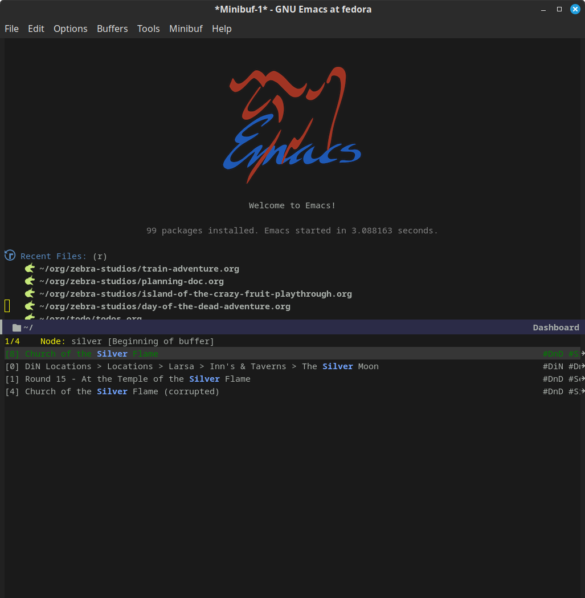

You can see the results narrowed and, more importantly, you can see that we are searching through not just the names, but the tags as well! This is very useful. From there we can select a file, hit return, and have it populate the buffer.

But what if the node doesn't exist at all? No problem, type in the node's name, hit return, and you will be prompted to create a new node.

### `C-c n i` - Insert a node

This is the primary way of linking nodes together. You insert a link into the current document to another node and Org Roam keeps track of that connection. The link you insert this way will automatically be tracked by Org Roam and used to populate the backlinks list.

**IMPORTANT NOTE** - A node does not need to exist to be inserted!

This was lost on the when I first started using Org Roam as I was under the impression that I needed to first create a node and then insert a link to it. Thankfully you can just insert a link to a node that doesn't exist and the create dialog will pop up allowing you to fully create the node. When you have captured that node, the insert command will complete and a link to your new node will appear.

### `C-c C` - Open a capture template

Much like Org Mode, you can open a capture template to create a new document. And like Org Mode, out of the box there is default option if you haven't yet created your own capture templates. This default option is very basic but absolutely fine for beginners to use until they have an idea of what their needs are.

*In the next section I will go over custom Org Roam Capture Templates, but as they can quickly get quite complex, I separated them out from the main configuration so as to make learning this easier.*

The capture templates here behave a bit differently than in standard Org Mode. The primary difference is when the capture template is called. In regular Org Mode you might hit `C-c c` to open a capture template, create a new TODO item, save it, and be on your way. Things are slightly different here. Here are the three ways you will invoke a capture template.

1.  you just invoke it directly like with Org Mode
2.  you find a node that doesn't exist, and it gets called automatically
3.  you insert a node that doesn't exist, and it gets called automatically

If you invoke it via methods 1 or 2, then you need to make sure you insert a link to it in another document somewhere so that you can easily find it again. You can of course always search for it in various ways if you forget about it, but generally speaking, it is best to insert a link to it somewhere immediately upon creation so you don't get orphaned nodes.

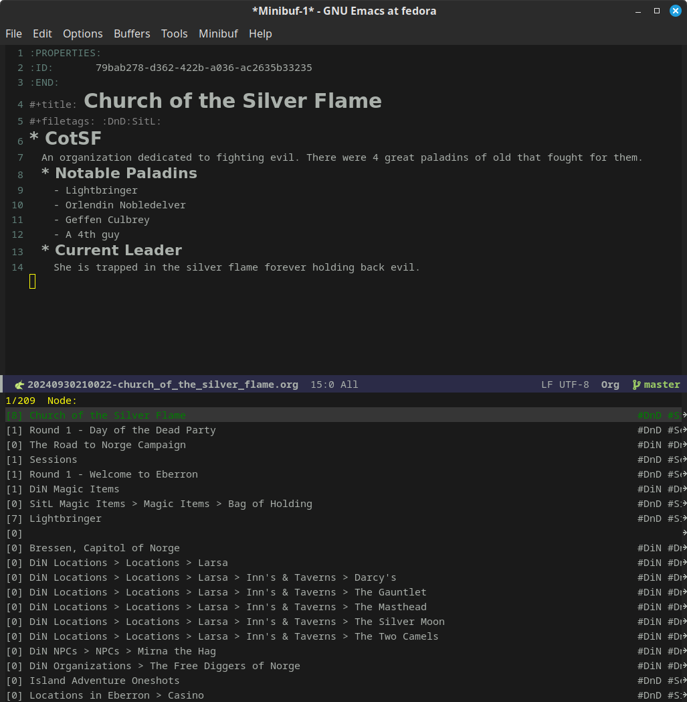

### `C-c n l` - Show backlinks

Finally we get to see the magic of Org Roam! This command will show us every node that links to the current node. As you can see, you get the node along with where specifically it is mentioned. All helpfully put into a list in a new buffer. Selecting any of the backlinks and hitting return will take you to the node in question.

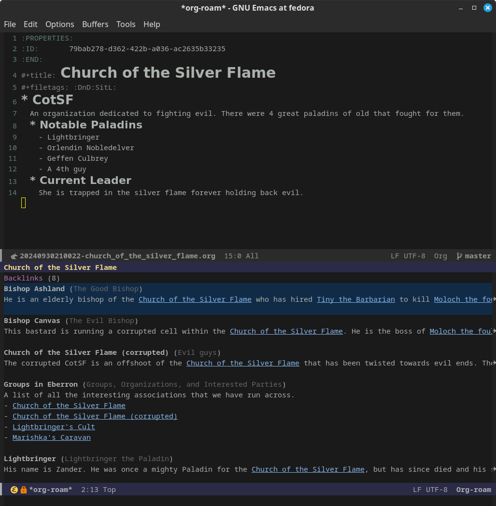

### `C-c n t` - Add a tag to filetags, NOT a headline

In Org Roam you can add tags to a node, but you don't add the tags in the same way you do in regular Org Mode. Instead, you add the tags to the `#+filetags:` field at the top of the file. Here is a sample of what a file heading looks like for one of my DnD sessions. You can see there are four tags associated with this file. All four tags will appear in the search results when I invoke `C-c n f` to find a node.

    :PROPERTIES:
    :ID:       9939d72f-acdb-45b7-92be-febff0bdf5d7
    :END:
    #+title: Round 1 - Day of the Dead Party
    #+filetags: :DnD:Session:oneshot:islandadventure:
    #+date: <2026-06-27 Sat 23:36>

### `C-c n o` - Create a node at a headline

Remember how I said earlier that every idea/concept/whatever should be it's own node? And that every node should be it's own file? Well this function exists when you need to make an exception. I've used this function a lot and I still don't really know if I like it or not, but I'm getting ahead of myself. This function takes a headline and turns it into a node. So you have a node inside another node.

The reason for doing this is that you might have a bunch of ideas that you want to index and easily find, but you also don't want to create an entire file for. This is where if you are a purist you might argue that any unique idea should be put in its own file, but I'm not a purist so I've been using them. Here is what I've been doing with this:

    :PROPERTIES:
    :ID:       33d36555-ddb0-45f1-8a5c-ccb492b7fff6
    :END:
    
    #+title: SitL Magic Items
    #+filetags: :DnD:SitL:
    
    * Magic Items
    A list of all the magic items we have encountered so far.
    
    ** Chalice of Purification
    :PROPERTIES:
    :ID:       1fa265a9-13cb-4b16-a7b3-c9ddee4e623d
    :END:
    - can cure poison 3 times a day
    - currently in Abel's bag of holding
    
    ** Cloak of Protection
    :PROPERTIES:
    :ID:       e837a3dc-e0a3-4c18-91b5-6f5d34b5e62f
    :END:
    - gives +1 to AC
    - gives +1 to saving throws
    - looks stylish
    - currently worn by Abel
    
    ** Gloves of Thievery
    :PROPERTIES:
    :ID:       96f9961e-b1ef-4e10-9588-bb415e9127e1
    :END:
    - invisible when worn
    - gives a +5 bonus to sleight of hand checks
    - gives a +5 bonus to lock picking checks
    - currently worn by Abel

Here I have a file titled `SitL Magic Items` and it is a node. I can search for that string and it will return this file. But I can also search for `Gloves of Thievery` and it will return this file with this heading, because this heading is also a node.

Generally I would advocate using this when you have small bits of data that won't change and can be easily grouped into a large node.

### `C-c n a` - Create an alias

As the name would suggest, this creates an alias for an existing node. There are no limits to the number of aliases you can use on one file. Personally, I don't ever find myself using this feature, however given a sufficiently similar set of nodes, perhaps a use case could arise that would make this handy. Otherwise, I have found that by using good titles and tags, I'm able to find anything I'm looking for. Once created, aliases look like this:

    ** Geffen Culbrey's Sword (great sword)
    :PROPERTIES:
    :ID:       21b8197f-d5e2-4818-b1c9-51a24b3b34ea
    :ROAM_ALIASES: "stabby stick" "magical weapons"
    :END:
    - 3 times a day you can deal an extra 2d8 damage
    - adds permanent +2 to hit
    - removes curses

### `C-c n r` - Grab random node

Finally we have the one function I have never used. However, if your collection of nodes gets sufficiently large and you want a surprise, opening a random node could be exciting. I guess.

## Org Roam Capture Templates

I purposefully separated this out from the basic configuration section because this, while incredibly useful, is optional. It adds a bunch of complexity and if you are already unsure if you even need Org Roam, spending a bunch of time messing with capture templates will just be a waste of time. However, if you want to expand what Org Roam can do for you, then crafting your own capture templates is the next step.

Hopefully you've already read the [Advanced Capture Templates](#org8ec2ae8) section of this guide and were suitably impressed. We are going to apply those same concepts to Org Roam. However, it isn't an exact 1:1 translation, so there are some minor things we will need to tweak. If you attempt to use the standard Org Mode syntax here, it will break your capture templates.

### Capture Template Example

Here is a sample of some of my capture templates:

    ;; Org Roam Capture Templates
    (setq org-roam-capture-templates
          '(
            ;; Default
            ("b" "blank node"
             plain
             "%?"
             :if-new (file+head "%<%Y%m%d%H%M%S>-${slug}.org" "#+title: ${title}\n")
             :unnarrowed t
             )
    
            ;;; DND Entry Group ;;;
            ("d" "New Magic Item/NPC/Location/Quest")
    
            ;; New Magic Item
            ("di" "New Magic Item"
             plain
             (file "~/org-roam/templates/dnd-new-magic-item.org")
             :if-new (file+head "dnd/items/%<%Y%m%d%H%M%S>-${slug}.org" "")
             :unnarrowed t
             )
    
            ;; New Session
            ("ds" "New Session"
             plain
             (file "~/org-roam/templates/dnd-new-session.org")
             :if-new (file+head "dnd/sessions/%<%Y%m%d%H%M%S>-${slug}.org" "")
             :unnarrowed t
             )
            )
          )

And here is one of the accompanying template files:

    #+title: ${title}
    #+filetags: :DnD:magicitem:%^G
    
    * %^{item-name}
    ** Description
    %^{item-description}
    ** Properties
     - %?

Something interesting to note here is that the path to this file is:

    ~/org-roam/templates/dnd-new-magic-item.org

However, this file does not have an Org Roam ID. I created these files manually, not via the normal node creation process. Which means it will not be searchable via the Find Node function. You can obviously still open it in the regular way, but this file (and all the template files) are specifically excluded from Org Roam's system. It is not meant to be searchable data and I don't ever want to accidentally modify it.

### Default Capture Template Syntax Explained

The default capture template is fairly straightforward. You can use it as a base for making other small capture templates. Let's look at the default capture template closer.

    ;; Default
    ("b" "blank node"
     plain
     "%?"
     :if-new (file+head "%<%Y%m%d%H%M%S>-${slug}.org" "#+title: ${title}\n")
     :unnarrowed t
     )

When you invoke this, here is the order of what happens.

1.  Type `C-c C` and the Find Node buffer appears
2.  Enter the name of your new node "New Test Node"
3.  When the capture template appears, select "b" for a new blank node
4.  The following file is generated:

    :PROPERTIES:
    :ID:       6c978f17-f573-4565-92a6-014b224749ca
    :END:
    #+title: New Test Node

At which point you can finish filling out whatever data you want, and then hit `C-c C-c` to save the node. Let's create another simple capture template. In this example you want to track all the courses you are currently taking in college. Every time you take a new course you create a new node that will serve as the root for all future nodes related to that. For example, that root node would contain links for each class you attend as well as course work, projects, due dates, etc. Now that we have an idea of what we want, let's make a template for it.

    ;; Default
    ("c" "college course"
     plain
     "%?"
     :if-new (file+head "%<%Y%m%d%H%M%S>-${slug}.org" "#+title: ${title}\n* \nDays: \nTime: ")
     :unnarrowed t
     )

Notice that we added some info after the title in the `:if-new` block. Since we only need a few extra lines, it doesn't clutter things up to much to stick them there. Now this new college course capture template produces this:

    :PROPERTIES:
    :ID:
    :END:
    #+title:
    *
    Days:
    Time:

Which, once filled it with our new self defense class "Kung Fu", would produce a file like this:

    :PROPERTIES:
    :ID:       6c978f17-f573-4565-92a6-014b224749ca
    :END:
    #+title: Kung Fu
    * Kung Fu 101: The art of gracefully punching someone in the face
    Days: M-W-F
    Time: 10:00am - 10:50am

Overall this is fairly functional and easy enough to use. You could easily tweak it to include more fields or a more detailed structure. If this is all you need then go with this. But if you need something a little more detailed, then we need to step up our game.

### Advanced Capture Template Syntax Explained

If the default capture template isn't enough for you then it is time to expand our horizons. Let's look at a subsection of the template from the beginning of the previous section. There are two important things going on here.

-   a subgroup is defined via the "d" key
-   a separate template file now defines the structure of the new node

Let's take this one at a time. Here is the snippet in question.

    ;;; DND Entry Group ;;;
    ("d" "New Magic Item/NPC/Location/Quest")
    
    ;; New Magic Item
    ("di" "New Magic Item"
     plain
     (file "~/org-roam/templates/dnd-new-magic-item.org")
     :if-new (file+head "dnd/items/%<%Y%m%d%H%M%S>-${slug}.org" "")
     :unnarrowed t
     )

To define a new subgroup we need to first define the base key. This is the key that you will type first to then show the subgroup that contains the actual capture templates. In this case, to create a new magic item you would open a capture template, type "d", then type "i", and then the new magic item node would be created and you can begin populating data.

Once you have created the subgroup you can create additional entries for that group. Remember that the shortcut must start with the subgroup letter for it to be properly picked up by the capture template. Which means that a new magic item must be prefaced with "di" and not just "i".

Let's look at the file that is specified with this line: `(file "~/org-roam/templates/dnd-new-magic-item.org")`

    #+title: ${title}                  ;; 1
    #+filetags: :DnD:magicitem:%^G     ;; 2
                                       ;; 3
    * %^{item-name}                    ;; 4
    ** Description                     ;; 5
    %^{item-description}               ;; 6
    ** Properties                      ;; 7
     - %?                              ;; 8

There is a lot going on here. I've added comments with line numbers to make referencing this easier. So let's break it down one line at a time.

**line 1** - This is the title of the node. You will notice that the string `${title}` gets automatically replaced with whatever you entered into the buffer when you executed the Find Node or Insert Node function.

**line 2** - The filetags are user defined tags. The last string `%^G` is the prompt for tags. After you enter the name of your node, the next thing you will enter is all the tags. A prompt with available tags will appear allowing you to select them. To select more than one, type one, then type `:`, and another tag can be added. You can see here that this capture template adds two tags by default, `DnD` and `magicitem`.

**line 3** - This is just a blank space to make your files look pretty.

**line 4** - Here we have a line that starts with a `*` followed by a space. This is our first heading. After entering the node name and the tags, you will get a third prompt for the `item-name`. Unlike with the tags, this prompt won't autocomplete anything. Once you enter the item name it will populate this heading.

**line 5** - A second level heading that is hard coded to the string `Description`. No prompts will appear here.

**line 6** - Now the fourth prompt appears. This is the for the item description. Write as much as you'd like in the buffer and when you hit return it will be entered under the description subheading.

**line 7** - Properties is the final subheading. Do not confuse this with the `:PROPERTIES:` drawer that is at the top of every node. This could just as easily have been renamed "Abilities".

**line 8** - Finally we encounter the `%?` string which is where your cursor will end up once you've finished entering data into the prompts and the node is created and ready to be completed.

Putting it all together, let's create a new magic item. Here is what I'm going to enter every step of the way:

1.  Start the capture template for Org Roam (`C-c C`)
2.  Enter the title of the new node (`Sword of Can't Even`)
3.  Select the `New Magic Item/NPC/Location/Quest` sub template (`d`)
4.  Select the `Magical Item` template (`i`)
5.  Enter the tag for this item (`sword`)
6.  Enter the full item name (`Erik's Irritating Sword of Can't Even`)
7.  Enter the item description (`This is a magical sword that has some annoying abilities`)
8.  Enter the properties (`This sword only hits on odd numbers...because it can't even`)
9.  Close and save the node (`C-c C-c` )

## Org Roam UI

As we wrap up our exploration of Org Roam, we come to (in my opinion) the coolest part of this entire guide, visualization! With all the work we've put in to configure Org Roam and then fill it with data, we deserve this. Org Roam UI spins up a nifty little webserver and display all of your nodes in an interconnected way. You can edit everything from the browser, change the colors, play with a bunch of settings, and generally have a good time clicking around your data. This is one of my favorite Emacs packages ever created and a big shout-out goes to everyone who made [Org Roam UI](https://github.com/org-roam/org-roam-ui) because it is great.

### Basic Configuration

This configuration was taken, almost in its entirety, from their github page. I added a shortcut to match with the rest of Org Roam's style, but as you can see, it works really well right out of the box.

    (use-package websocket
      :after org-roam)
    
    (use-package org-roam-ui
      :after org-roam ;; or :after org
      ;;         normally we'd recommend hooking orui after org-roam, but since org-roam does not have
      ;;         a hookable mode anymore, you're advised to pick something yourself
      ;;         if you don't care about startup time, use
      ;;  :hook (after-init . org-roam-ui-mode)
      :bind (("C-c n g" . org-roam-ui-open))
      :config
      (setq org-roam-ui-sync-theme t
            org-roam-ui-follow t
            org-roam-ui-update-on-save t
            org-roam-ui-open-on-start t)
      )

Check out their github page for more options, but this should do it for you. As I said, I added a shortcut to call `org-roam-ui-open` more easily, but that's it.

### Awesome Examples

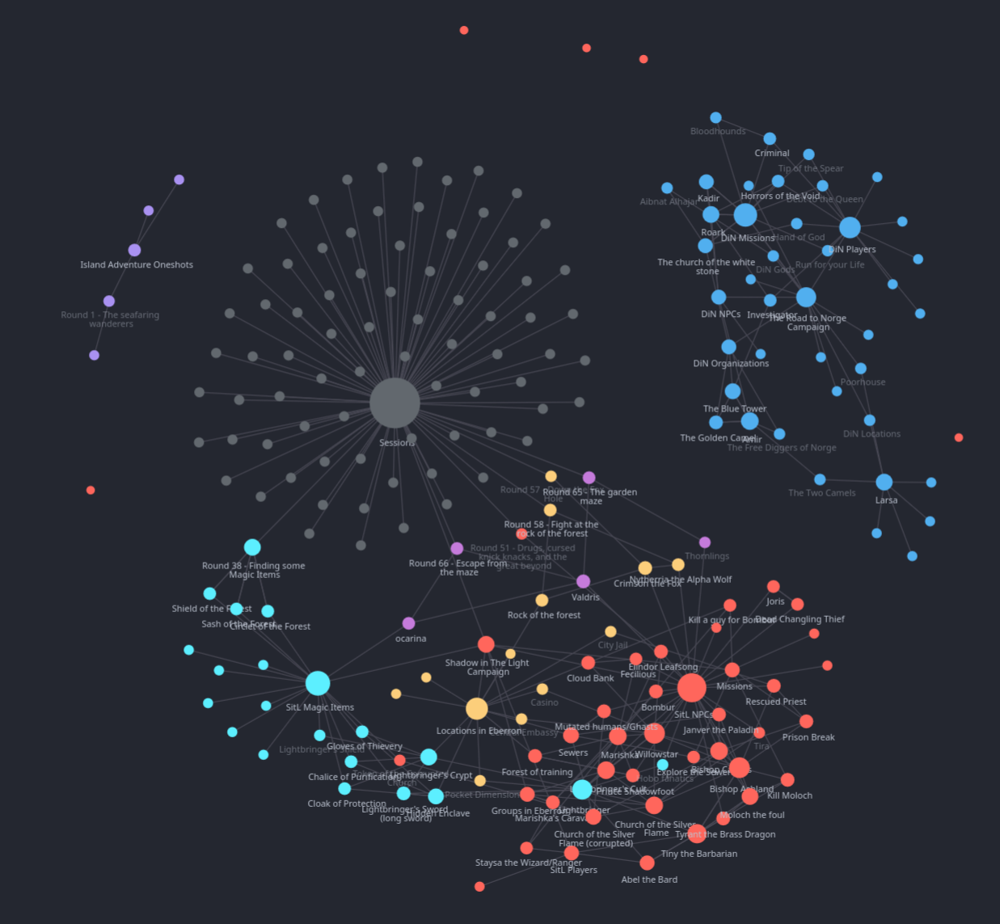

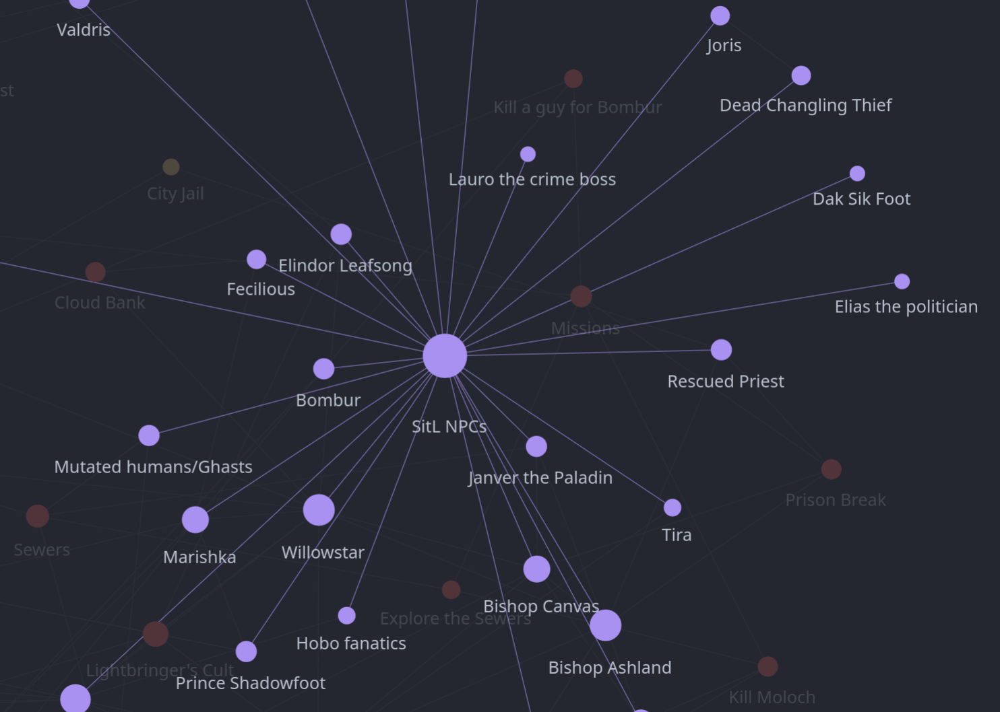

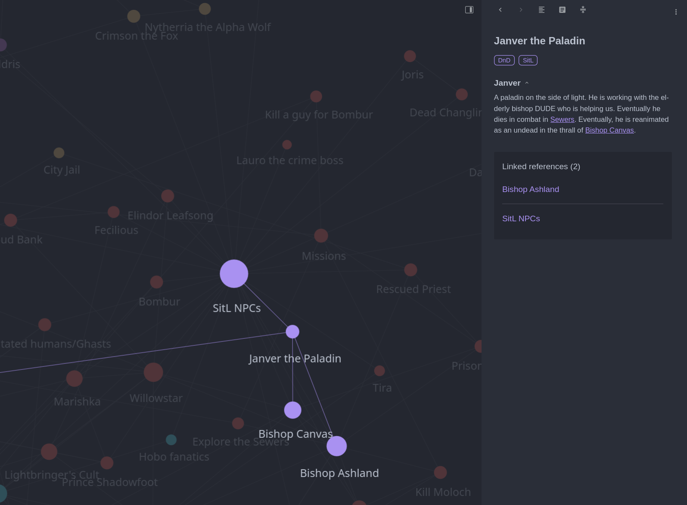

# Farewell

I wrote this guide because I find the Org ecosystem to be incredibly useful and I wanted others to benefit from my knowledge. But as much as I've covered here today, there are many things left to discover. Lots of people are using Org Mode in new and creative ways and I encourage you to seek them out. I hope you found this guide useful. Good luck as you remake your workflows and become ever better organized.

